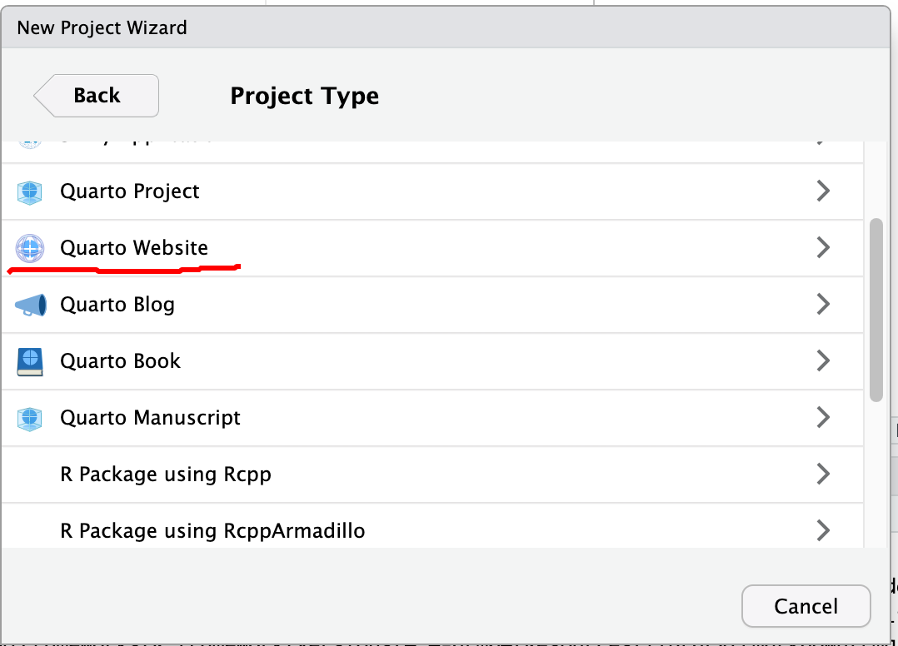

## Develop Websites using R

With RStudio and Quarto, there are quite a few options to develop simple but neat websites. From the RStudio, New Project, we can create [Quarto Website](https://quarto.org/docs/websites/), Bookdown, blogdown, and Simple R Markdown websites. Particularly for Quarto Website, all the interactive capabilities allowed by OJS could be incorporated.

The Quarto Website is based on a bootstrap template and has a simplistic appearance.

Importantly, Quarto or R markdown can directly hold DIV, which can be used by many JavaScript libraries to plot charts, maps, or tables.

::: {#ll_map style="width: 100%; height: 400px"}
This is a DIV Section with an ID of "ll_map" and style of "width: 100%; height: 400px".

JavaScript files could be included in HTML options using "include-in-header", "include-before-body", and "include-after-body".

[Html reference](https://quarto.org/docs/reference/formats/html.html)
:::

Quart Markdown can also directly use `OJS, htmlwidgets` to add maps and interactivity to the rendered webpages.

## Jekyll and Jekyll Themes

Today, way more people are using [Jekyll](https://jekyllrb.com/) and pre-defined [Jekyll Theme](https://github.com/topics/jekyll-theme) to develop websites. Starting from scratch is too time-consuming for most developers. Here are a few key steps, with Mac OS as an example.

### [Install Jekyll Ruby](https://jekyllrb.com/docs/installation/)

-   Following the Jekyll installation guide. This is the simplest way to install Jekyll

### [Install Ruby](https://www.ruby-lang.org/en/downloads/): a more complicated way

Although Ruby is installed on Mac by default, it is necessary to install the lasted and an independent version of Ruby to avoid interference with the system default.

In order to do that, we need some [Ruby Installer or Version/Environment Manager](https://www.ruby-lang.org/en/downloads/)

-   On Mac OS

    -   Install [Homebrew](https://brew.sh/), which is a package management system on Mac OS written in Ruby.

        -   Basically, just run the following bash command/script

            `/bin/bash -c "$(curl -fsSL https://raw.githubusercontent.com/Homebrew/install/HEAD/install.sh)"`

        -   Follow the prompts to add brew to shell path.

    -   Install [`rbenv`](https://github.com/rbenv/rbenv), a version management tool for Ruby programming language

        -   Run `brew install rbenv`

        -   As instructed, run `rbenv init` and restart terminal to make it take effects

    -   [Install Ruby using rbenv](https://github.com/rbenv/rbenv?tab=readme-ov-file#installing-ruby-versions)

        -   Although `Homebrew` can install Ruby directly with `brew install ruby`, it is not recommended as `rbenv` gives us more control. This is similar to how `conda` works for Python.
        -   Use `rbenv install -l` to show the latest stable version
        -   Use `rbenv install 3.3.5` to install a specific version

    -   Download the templates from Github to the local computer

        -   Follow the theme instructions

        -   Some folders and documents such as online documentation are not used and can be deleted.

    -   Edit the pages of the website

    -   Build, Test, and Serve

        -   Pay attention to the error messages.

        -   Use `bundle` to install Ruby gems indicated in the project Gemfile.

        -   Basically, we need to remove the `_site` folder first by using `rm -f -r _site` command.

        -   Using `jekyll build` to build the site

        -   Or using `jekyll serve` to start serving for the website for development
